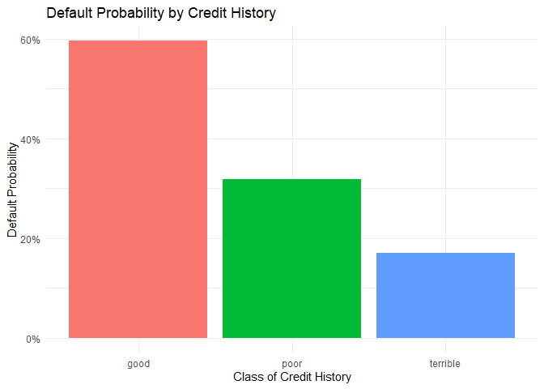
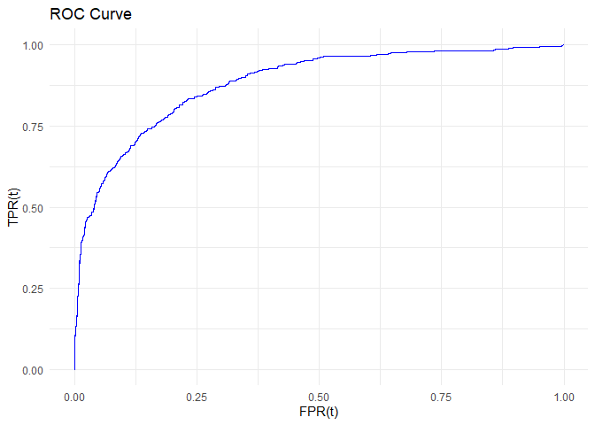
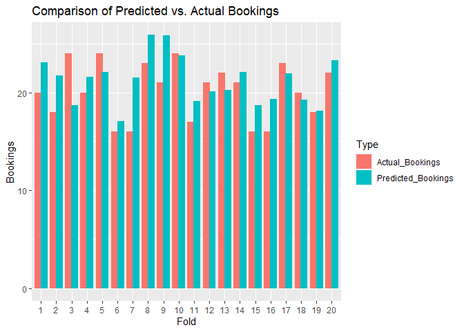
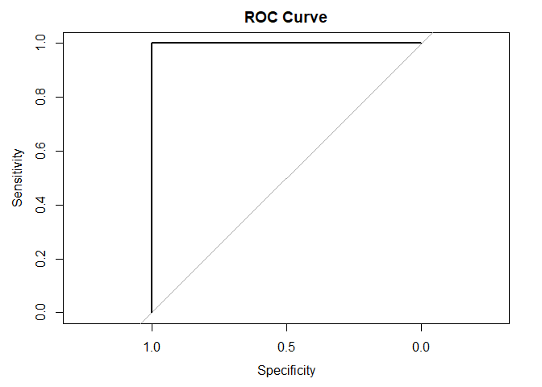

# ECO 395M HW 1: Daniel Oliner, Musab Alquwaee, Jacob McGill

# Q1: Executive Summary

Focusing on the data set on house prices in Saratoga, NY, this report
presents a comparative analysis of two model classes: Linear Models and
K-Nearest-Neighbors. We will begin by building a comprehensive linear
model, then a KNN model, then will evaluate the two models’ efficacy and
predictive accuracy by comparing their out-of-sample mean-squared error.
The goal is to identify a model that combines high predictive accuracy
with practicality for use by the local taxing authority.

## Question 1: Part 1: Building an Enhanced Linear Model

    ## Start:  AIC=30413.68
    ## price ~ lotSize + age + landValue + livingArea + pctCollege + 
    ##     bedrooms + fireplaces + bathrooms + rooms + heating + fuel + 
    ##     sewer + waterfront + newConstruction + centralAir
    ## 
    ##                   Df  Sum of Sq        RSS   AIC
    ## - sewer            2 2.1505e+09 4.8560e+12 30410
    ## - fuel             2 4.6515e+09 4.8585e+12 30411
    ## - pctCollege       1 8.2937e+06 4.8539e+12 30412
    ## - fireplaces       1 4.8597e+08 4.8543e+12 30412
    ## <none>                          4.8539e+12 30414
    ## - age              1 8.1239e+09 4.8620e+12 30414
    ## - heating          2 1.8468e+10 4.8723e+12 30415
    ## - centralAir       1 2.2889e+10 4.8767e+12 30418
    ## - rooms            1 3.4036e+10 4.8879e+12 30421
    ## - lotSize          1 3.7352e+10 4.8912e+12 30422
    ## - bedrooms         1 3.8919e+10 4.8928e+12 30423
    ## - newConstruction  1 1.0104e+11 4.9549e+12 30440
    ## - bathrooms        1 1.3301e+11 4.9869e+12 30449
    ## - waterfront       1 1.7360e+11 5.0275e+12 30460
    ## - livingArea       1 6.3076e+11 5.4846e+12 30581
    ## - landValue        1 9.9514e+11 5.8490e+12 30669
    ## 
    ## Step:  AIC=30410.29
    ## price ~ lotSize + age + landValue + livingArea + pctCollege + 
    ##     bedrooms + fireplaces + bathrooms + rooms + heating + fuel + 
    ##     waterfront + newConstruction + centralAir
    ## 
    ##                   Df  Sum of Sq        RSS   AIC
    ## - fuel             2 4.3899e+09 4.8604e+12 30408
    ## - pctCollege       1 1.0080e+07 4.8560e+12 30408
    ## - fireplaces       1 4.6041e+08 4.8565e+12 30408
    ## <none>                          4.8560e+12 30410
    ## - age              1 8.2127e+09 4.8642e+12 30411
    ## - heating          2 1.8870e+10 4.8749e+12 30412
    ## - centralAir       1 2.2516e+10 4.8785e+12 30415
    ## - rooms            1 3.4077e+10 4.8901e+12 30418
    ## - bedrooms         1 3.7967e+10 4.8940e+12 30419
    ## - lotSize          1 4.6652e+10 4.9027e+12 30422
    ## - newConstruction  1 1.0183e+11 4.9578e+12 30437
    ## - bathrooms        1 1.3151e+11 4.9875e+12 30445
    ## - waterfront       1 1.7352e+11 5.0295e+12 30457
    ## - livingArea       1 6.3151e+11 5.4875e+12 30577
    ## - landValue        1 9.9655e+11 5.8526e+12 30666
    ## 
    ## Step:  AIC=30407.54
    ## price ~ lotSize + age + landValue + livingArea + pctCollege + 
    ##     bedrooms + fireplaces + bathrooms + rooms + heating + waterfront + 
    ##     newConstruction + centralAir
    ## 
    ##                   Df  Sum of Sq        RSS   AIC
    ## - pctCollege       1 4.0000e+00 4.8604e+12 30406
    ## - fireplaces       1 4.9077e+08 4.8609e+12 30406
    ## <none>                          4.8604e+12 30408
    ## - age              1 8.7092e+09 4.8691e+12 30408
    ## - heating          2 2.6497e+10 4.8869e+12 30411
    ## - centralAir       1 2.1974e+10 4.8824e+12 30412
    ## - rooms            1 3.4459e+10 4.8949e+12 30415
    ## - bedrooms         1 3.7555e+10 4.8980e+12 30416
    ## - lotSize          1 4.5931e+10 4.9063e+12 30419
    ## - newConstruction  1 1.0048e+11 4.9609e+12 30434
    ## - bathrooms        1 1.3093e+11 4.9913e+12 30442
    ## - waterfront       1 1.7503e+11 5.0354e+12 30454
    ## - livingArea       1 6.3622e+11 5.4966e+12 30576
    ## - landValue        1 1.0093e+12 5.8697e+12 30666
    ## 
    ## Step:  AIC=30405.54
    ## price ~ lotSize + age + landValue + livingArea + bedrooms + fireplaces + 
    ##     bathrooms + rooms + heating + waterfront + newConstruction + 
    ##     centralAir
    ## 
    ##                   Df  Sum of Sq        RSS   AIC
    ## - fireplaces       1 4.9815e+08 4.8609e+12 30404
    ## <none>                          4.8604e+12 30406
    ## - age              1 8.7095e+09 4.8691e+12 30406
    ## - heating          2 2.6499e+10 4.8869e+12 30409
    ## - centralAir       1 2.2451e+10 4.8828e+12 30410
    ## - rooms            1 3.4460e+10 4.8949e+12 30413
    ## - bedrooms         1 3.7671e+10 4.8981e+12 30414
    ## - lotSize          1 4.6251e+10 4.9066e+12 30417
    ## - newConstruction  1 1.0348e+11 4.9639e+12 30433
    ## - bathrooms        1 1.3095e+11 4.9913e+12 30440
    ## - waterfront       1 1.7821e+11 5.0386e+12 30453
    ## - livingArea       1 6.3631e+11 5.4967e+12 30574
    ## - landValue        1 1.0382e+12 5.8986e+12 30671
    ## 
    ## Step:  AIC=30403.68
    ## price ~ lotSize + age + landValue + livingArea + bedrooms + bathrooms + 
    ##     rooms + heating + waterfront + newConstruction + centralAir
    ## 
    ##                   Df  Sum of Sq        RSS   AIC
    ## <none>                          4.8609e+12 30404
    ## - age              1 8.4799e+09 4.8694e+12 30404
    ## - heating          2 2.6695e+10 4.8876e+12 30407
    ## - centralAir       1 2.1956e+10 4.8828e+12 30408
    ## - rooms            1 3.4728e+10 4.8956e+12 30412
    ## - bedrooms         1 3.7738e+10 4.8986e+12 30412
    ## - lotSize          1 4.6073e+10 4.9070e+12 30415
    ## - newConstruction  1 1.0301e+11 4.9639e+12 30431
    ## - bathrooms        1 1.3067e+11 4.9916e+12 30438
    ## - waterfront       1 1.7820e+11 5.0391e+12 30451
    ## - livingArea       1 6.5025e+11 5.5111e+12 30575
    ## - landValue        1 1.0377e+12 5.8986e+12 30669

    ## 
    ## Call:
    ## lm(formula = price ~ lotSize + age + landValue + livingArea + 
    ##     bedrooms + bathrooms + rooms + heating + waterfront + newConstruction + 
    ##     centralAir, data = saratoga_train)
    ## 
    ## Residuals:
    ##     Min      1Q  Median      3Q     Max 
    ## -223962  -35177   -5393   26927  450993 
    ## 
    ## Coefficients:
    ##                          Estimate Std. Error t value Pr(>|t|)    
    ## (Intercept)             1.070e+05  2.101e+04   5.093 4.02e-07 ***
    ## lotSize                 8.241e+03  2.288e+03   3.602 0.000327 ***
    ## age                    -9.934e+01  6.428e+01  -1.545 0.122483    
    ## landValue               9.429e-01  5.516e-02  17.095  < 2e-16 ***
    ## livingArea              6.906e+01  5.104e+00  13.533  < 2e-16 ***
    ## bedrooms               -9.497e+03  2.913e+03  -3.260 0.001141 ** 
    ## bathrooms               2.300e+04  3.791e+03   6.066 1.69e-09 ***
    ## rooms                   3.425e+03  1.095e+03   3.127 0.001801 ** 
    ## heatinghot water/steam -1.080e+04  4.775e+03  -2.262 0.023826 *  
    ## heatingelectric        -8.945e+03  4.515e+03  -1.981 0.047787 *  
    ## waterfrontNo           -1.200e+05  1.693e+04  -7.084 2.23e-12 ***
    ## newConstructionNo       4.356e+04  8.087e+03   5.386 8.46e-08 ***
    ## centralAirNo           -9.717e+03  3.908e+03  -2.487 0.013013 *  
    ## ---
    ## Signif. codes:  0 '***' 0.001 '**' 0.01 '*' 0.05 '.' 0.1 ' ' 1
    ## 
    ## Residual standard error: 59590 on 1369 degrees of freedom
    ## Multiple R-squared:  0.6442, Adjusted R-squared:  0.6411 
    ## F-statistic: 206.5 on 12 and 1369 DF,  p-value: < 2.2e-16

Started by running an “everything and the kitchen sink” model and then
used a backwards selection approach to iteratively delete statistically
insignificant variables in order to improve model performance.

    ## 
    ## Call:
    ## lm(formula = price ~ lotSize + age + landValue + livingArea + 
    ##     bedrooms + bathrooms + rooms + heating + waterfront + newConstruction + 
    ##     centralAir + livingArea:bedrooms + log(livingArea), data = saratoga_train)
    ## 
    ## Residuals:
    ##     Min      1Q  Median      3Q     Max 
    ## -272408  -34240   -4958   26248  444591 
    ## 
    ## Coefficients:
    ##                          Estimate Std. Error t value Pr(>|t|)    
    ## (Intercept)             8.300e+05  1.853e+05   4.479 8.13e-06 ***
    ## lotSize                 7.330e+03  2.286e+03   3.207 0.001374 ** 
    ## age                    -9.610e+01  6.411e+01  -1.499 0.134095    
    ## landValue               9.027e-01  5.585e-02  16.163  < 2e-16 ***
    ## livingArea              1.865e+02  2.906e+01   6.416 1.92e-10 ***
    ## bedrooms                1.804e+04  7.922e+03   2.277 0.022917 *  
    ## bathrooms               2.451e+04  3.788e+03   6.470 1.36e-10 ***
    ## rooms                   2.785e+03  1.103e+03   2.525 0.011673 *  
    ## heatinghot water/steam -9.128e+03  4.770e+03  -1.914 0.055868 .  
    ## heatingelectric        -8.736e+03  4.517e+03  -1.934 0.053324 .  
    ## waterfrontNo           -1.211e+05  1.685e+04  -7.186 1.09e-12 ***
    ## newConstructionNo       4.484e+04  8.058e+03   5.564 3.16e-08 ***
    ## centralAirNo           -1.073e+04  3.906e+03  -2.748 0.006083 ** 
    ## log(livingArea)        -1.253e+05  3.113e+04  -4.024 6.02e-05 ***
    ## livingArea:bedrooms    -1.430e+01  4.016e+00  -3.561 0.000383 ***
    ## ---
    ## Signif. codes:  0 '***' 0.001 '**' 0.01 '*' 0.05 '.' 0.1 ' ' 1
    ## 
    ## Residual standard error: 59260 on 1367 degrees of freedom
    ## Multiple R-squared:  0.6486, Adjusted R-squared:  0.645 
    ## F-statistic: 180.2 on 14 and 1367 DF,  p-value: < 2.2e-16

We proceeded by creating a model with the relevant variables remaining
after the backwards selection process, then adding a relevant
interaction term (living area:bedrooms) and one logarithmic
transformation. We included an interaction of living area size and
number of bedrooms because we suspected that the combination of living
area size and the number of bedrooms together influence the price of a
house in ways that considering each of these factors alone cannot
capture. We also included a logarithmic transformation of the living
area variable in order to capture how proportional changes in living
area affect price, allowing for non-linearity in the relationship
between these variables.

    ## Using parallel package.
    ##   * Set seed with set.rseed().
    ##   * Disable this message with options(`mosaic:parallelMessage` = FALSE)

    ## Average Out-of-Sample RMSE Across 100 Train/Test Splits

    ##         lm2 lm_enhanced 
    ##    65498.41    57964.39

As evidenced above, the average out-of-sample RMSE for our enhanced
model is clearly lower than that of the previously considered medium
model. We used the average RMSEs over 100 train/test splits in order to
account for random variation in measuring out-of-sample performance.

## Question 1: Part 2: Building the KNN Model

    ## k-Nearest Neighbors 
    ## 
    ## 1383 samples
    ##   10 predictor
    ## 
    ## Pre-processing: centered (10), scaled (10) 
    ## Resampling: Cross-Validated (10 fold, repeated 3 times) 
    ## Summary of sample sizes: 1244, 1246, 1246, 1244, 1246, 1244, ... 
    ## Resampling results across tuning parameters:
    ## 
    ##   k    RMSE      Rsquared   MAE     
    ##    14  65596.47  0.5758291  45632.29
    ##   118  72173.83  0.5248243  49006.41
    ##   179  74122.32  0.5099177  49781.43
    ##   195  74623.45  0.5055043  50083.18
    ##   229  75568.76  0.5001878  50616.50
    ##   244  75967.34  0.4976787  50834.51
    ##   299  77330.09  0.4914922  51612.39
    ##   306  77519.96  0.4905998  51724.76
    ##   426  80415.64  0.4810244  53488.36
    ## 
    ## RMSE was used to select the optimal model using the smallest value.
    ## The final value used for the model was k = 14.

    ##         RMSE     Rsquared          MAE 
    ## 5.709346e+04 6.166043e-01 4.212205e+04

### Model Comparison: Linear Model vs KNN

    ## Average Out-of-Sample RMSE By Model

    ##         lm2 lm_enhanced  KNN (k=14) 
    ##    65498.41    57964.39    57093.46

## Q1: Conclusion

Based on our analysis, the KNN model seems to do better at achieving a
lower out-of-sample mean squared error, indicating a higher level of
predictive accuracy relative to the linear model. This suggests that for
the purpose of estimating house prices in Saratoga, NY, the KNN model
might be the preferred choice. However, it’s important to note that the
difference in performance between the two models is relatively modest.
The choice between these models should also consider factors such as
interpretability and ease of implementation. While the KNN model offers
marginally better accuracy, the enhanced linear model provides clearer
insights into how specific features influence house prices, which could
be valuable for policy formulation and decision-making by the local
taxing authority. Considering the taxing authority’s need to predict
property values to determine tax policy, the slightly lower RMSE
achieved by the KNN model suggests that the KNN model is performing
marginally better at predicting property values in this context.

# Question 2: German Credit Data

    ##         (Intercept)            duration              amount         installment 
    ##               -0.71                0.03                0.00                0.22 
    ##                 age         historypoor     historyterrible          purposeedu 
    ##               -0.02               -1.11               -1.88                0.72 
    ## purposegoods/repair       purposenewcar      purposeusedcar       foreigngerman 
    ##                0.10                0.85               -0.80               -1.26

The data and analysis from a German bank highlight a puzzling
relationship between credit history and loan defaults. The bar plot
indicates that worse credit history is associated with higher default
rates. However, the logistic regression model suggests the opposite,
with ‘poor’ and ‘terrible’ credit histories associated with lower
default probabilities, which contradicts common financial intuition.

This contradiction is likely due to the bank’s sampling method, which
oversamples defaults. This method creates a bias, making the model less
applicable to the general population of borrowers. For the model to be
useful in screening new borrowers, the bank needs to use a sample that
accurately reflects the true default rate in its overall portfolio.
Correcting this sampling bias is essential for the bank to develop a
reliable model for classifying borrowers by default risk.

# Question 3: Hotel Bookings

## Model Engineering

To estimate the performance of these 3 models, we will use K-fold cross
validation with K = 10 to calculate the RMSE for each linear probability
model.

The 1st model has the following estimated RMSE:

    spec_rmse

    ## [1] 0.2682111

The model with all the data provided (exlcuding arrival date) has the
following estimated RMSE:

    all_rmse

    ## [1] 0.2332761

For the best performing model, we expanded off the all model and added
several interaction terms and polynomials. We fitted adults to a 2nd
degree polynomial, since increasing adults up to likely increases the
chance of children coming but after the would decrease. We also fitted
lead time to a 2nd degree polynomial, since reservations booked very
early and very late would likely be business trips, as well as total
number of special requests since families may make some requests for
their children but a large amount indicates some special or business
event. Finally, stay in weekend nights and stay in week nights were
fitted to 2nd degree polynomials as well, as large amounts of both would
indicate long term stays, which would likely not have children. I also
added an interaction term for is\_repeated\_guest and
previous\_bookings\_not\_canceled, as that may indicate a repeat
customer who makes sudden changes to their bookings, which would likely
not have a child. Finally, I extracted several pieces of data from the
timestamp of arrival. “Summer” marks whether the reservation was in the
Summer, a time when children are more likely to be traveling. I also
added week\_end arrival, which tracked if the reservation started on
Friday or Saturday. As people arriving on those days are likely
traveling for vacation rather than business, it would be reasonable to
assume children would be more likely to be on the reservation.

The RMSE for the engineered model is:

    engineered_rmse

    ## [1] 0.2323567

As can be seen, this model outperforms the other 2 in terms of RMSE.

## Data Validation

I am then moving on to validating the data with the hotels\_val set. To
do so, I graph the the model’s Total Positivity Rate (TPR) and False
Positivity Rate (FPR) as a function of t, the threshold for considering
a predicted probability a yes.

    ggplot(data = coords(roc_graph), aes(x = 1 - specificity, y = sensitivity)) +
      geom_line(color = "blue") +
      labs(title = "ROC Curve") +
      labs(x = "FPR(t)", y = "TPR(t)")  +
      theme_minimal()

## Fold test

After graphing the ROC curve, we move to testing model against 20 equal
sized folds int he validation data set.

The below figure summarizes this performance, with the red bars being
the actual amount of bookings with children and the red the predicted
amount of bookings. As can be seen, the model does moderately well at
predicting the total number of bookings with children. While the model
did not perfectly predict a fold, it was never substantially of (such as
having a prediction off by 10 or more). Considering that each fold has
about 250 bookings, that is not a substantial deviance.

    graph_comparison = melt(comparison_data, id.vars = "Fold", variable.name = "Type", value.name = "Sum")

    ggplot(graph_comparison, aes(x = factor(Fold), y = Sum, fill = Type)) +
      geom_bar(stat = "identity", position = position_dodge(width = 0.8)) +
      labs(x = "Fold", y = "Bookings", title = "Comparison of Predicted vs. Actual Bookings") 

# Question 4: Poisonous Mushrooms

    ## [1] "Optimal lambda: 0.000676086748498989"

    ## Setting levels: control = 0, case = 1

    ## Setting direction: controls < cases

    ## Area under the curve: 1

    ##          Actual
    ## Predicted   0   1
    ##         0 841   0
    ##         1   0 783

    ## [1] "True Positive Rate: 1"

    ## [1] "False Positive Rate: 0"

The document contains results from a Lasso regression model with 10-fold
cross-validation, indicating an optimal lambda value of approximately
0.000676. The area under the ROC curve (AUC) is 1, suggesting perfect
model performance. The confusion matrix shows no misclassifications,
with 841 true negatives and 783 true positives, leading to a True
Positive Rate (TPR) of 1 and a False Positive Rate (FPR) of 0. These
results suggest that the model perfectly distinguishes between the
classes without any errors, so a threshold of 1 would be recommended for
declaring a mushroom poisonous.
