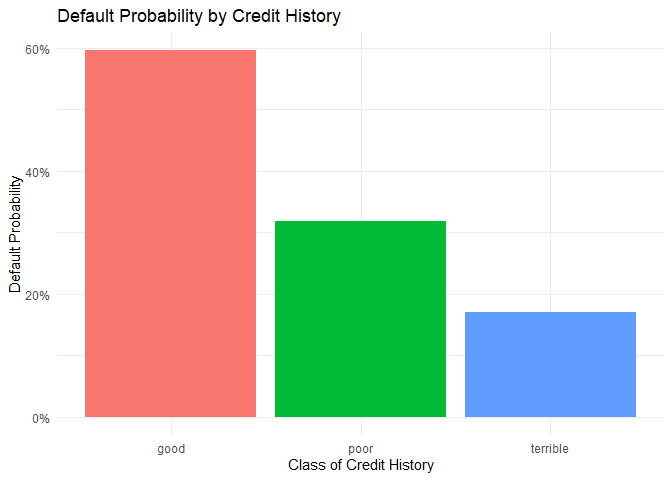
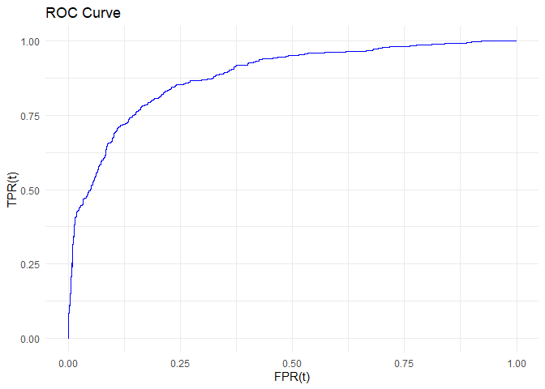
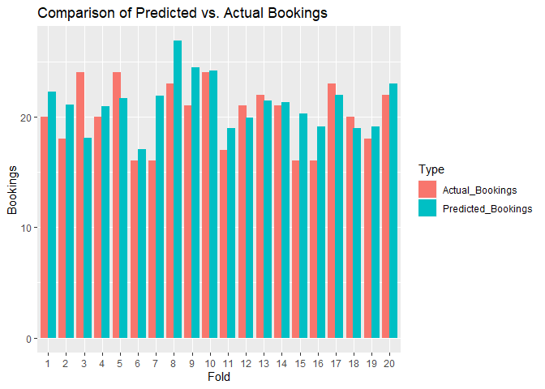

# ECO 395M HW 1: Daniel Oliner, Musab Alquwaee, Jacob McGill

# Question 2

    ##         (Intercept)            duration              amount         installment 
    ##               -0.71                0.03                0.00                0.22 
    ##                 age         historypoor     historyterrible          purposeedu 
    ##               -0.02               -1.11               -1.88                0.72 
    ## purposegoods/repair       purposenewcar      purposeusedcar       foreigngerman 
    ##                0.10                0.85               -0.80               -1.26

The data and analysis from a German bank highlight a puzzling
relationship between credit history and loan defaults. The bar plot
indicates that worse credit history is associated with higher default
rates. However, the logistic regression model suggests the opposite,
with ‘poor’ and ‘terrible’ credit histories associated with lower
default probabilities, which contradicts common financial intuition.

This contradiction is likely due to the bank’s sampling method, which
oversamples defaults. This method creates a bias, making the model less
applicable to the general population of borrowers. For the model to be
useful in screening new borrowers, the bank needs to use a sample that
accurately reflects the true default rate in its overall portfolio.
Correcting this sampling bias is essential for the bank to develop a
reliable model for classifying borrowers by default risk.

# Question 3: Hotel Bookins

## Model Engineering

To estimate the performance of these 3 models, we will use K-fold cross
validation with K = 10 to calculate the RMSE for each linear probability
model.

The 1st model has the following estimated RMSE:

    spec_rmse

    ## [1] 0.2682111

The model with all the data provided (exlcuding arrival date) has the
following estimated RMSE:

    all_rmse

    ## [1] 0.2332761

For the best performing model, we expanded off the all model and added
several interaction terms and polynomials. We fitted adults to a 2nd
degree polynomial, since increasing adults up to likely increases the
chance of children coming but after the would decrease. We also fitted
lead time to a 2nd degree polynomial, since reservations booked very
early and very late would likely be business trips, as well as total
number of special requests since families may make some requests for
their children but a large amount indicates some special or business
event. Finally, stay in weekend nights and stay in week nights were
fitted to 2nd degree polynomials as well, as large amounts of both would
indicate long term stays, which would likely not have children. I also
added an interaction term for is\_repeated\_guest and
previous\_bookings\_not\_canceled, as that may indicate a repeat
customer who makes sudden changes to their bookings, which would likely
not have a child. Finally, I extracted several pieces of data from the
timestamp of arrival. “Summer” marks whether the reservation was in the
Summer, a time when children are more likely to be traveling. I also
added week\_end arrival, which tracked if the reservation started on
Friday or Saturday. As people arriving on those days are likely
traveling for vacation rather than business, it would be reasonable to
assume children would be more likely to be on the reservation.

The RMSE for the engineered model is:

    engineered_rmse

    ## [1] 0.2323567

As can be seen, this model outperforms the other 2 in terms of RMSE.

## Data Validation

I am then moving on to validating the data with the hotels\_val set. To
do so, I graph the the model’s Total Positivity Rate (TPR) and False
Positivity Rate (FPR) as a function of t, the threshold for considering
a predicted probability a yes.

    ggplot(data = coords(roc_graph), aes(x = 1 - specificity, y = sensitivity)) +
      geom_line(color = "blue") +
      labs(title = "ROC Curve") +
      labs(x = "FPR(t)", y = "TPR(t)")  +
      theme_minimal()

## Fold test

After graphing the ROC curve, we move to testing model against 20 equal
sized folds int he validation data set.

The below figure summarizes this performance, with the red bars being
the actual amount of bookings with children and the red the predicted
amount of bookings. As can be seen, the model does moderately well at
predicting the total number of bookings with children. While the model
did not perfectly predict a fold, it was never substantially of (such as
having a prediction off by 10 or more). Considering that each fold has
about 250 bookings, that is not a substantial deviance.

    graph_comparison = melt(comparison_data, id.vars = "Fold", variable.name = "Type", value.name = "Sum")

    ggplot(graph_comparison, aes(x = factor(Fold), y = Sum, fill = Type)) +
      geom_bar(stat = "identity", position = position_dodge(width = 0.8)) +
      labs(x = "Fold", y = "Bookings", title = "Comparison of Predicted vs. Actual Bookings") 

